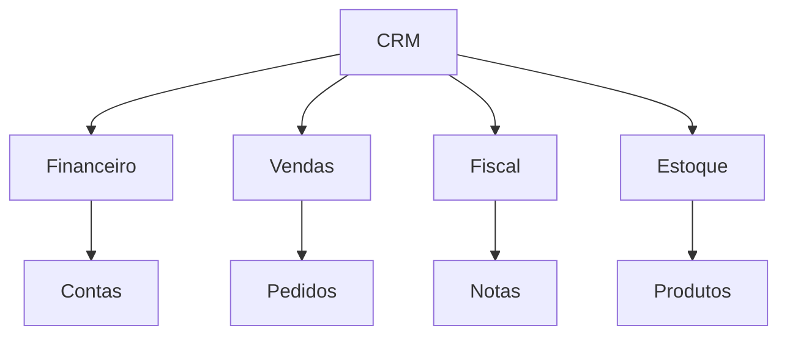

# Documentação Técnica - Módulo CRM (Customer Relationship Management)
## Sistema ADM v4.5

## Índice
1. [Visão Geral](#1-visão-geral)
2. [Arquitetura](#2-arquitetura)
3. [Fluxos de Processo](#3-fluxos-de-processo)
4. [Componentes](#4-componentes)
5. [Integrações](#5-integrações)
6. [Desenvolvimento](#6-desenvolvimento)
7. [Manutenção](#7-manutenção)

## 1. Visão Geral

### 1.1 Propósito
O módulo CRM é responsável pelo gerenciamento de relacionamento com clientes no sistema ADM v4.5. O módulo permite:
- Cadastro e gestão de clientes
- Acompanhamento de contas
- Gestão de oportunidades
- Dashboard de vendas
- Agenda e calendário
- Relatórios gerenciais

### 1.2 Funcionalidades Principais
- Cadastro de clientes (PF/PJ)
- Gestão de contas
- Acompanhamento de oportunidades
- Dashboard de vendas
- Agenda e calendário
- Relatórios gerenciais

## 2. Arquitetura

### 2.1 Estrutura de Diretórios
```
/var/www/html/admv4.5/
├── forms/crm/                    # Formulários PHP
│   ├── p_contas.php             # Controlador de contas
│   ├── p_contas_acompanhamento.php # Acompanhamento
│   ├── p_contas_oportunidade.php # Oportunidades
│   ├── p_crm_dashboard.php      # Dashboard
│   ├── p_calendar.php           # Calendário
│   └── p_atividade.php          # Atividades
├── class/crm/                    # Classes PHP
│   ├── c_conta.php              # Classe principal
│   ├── c_contas_acompanhamento.php # Acompanhamento
│   ├── c_dashboard.php          # Dashboard
│   ├── c_pessoa.php             # Gestão de pessoas
│   └── c_proposta.php           # Propostas
├── js/crm/                      # JavaScript
│   ├── s_conta.js               # Lógica de contas
│   └── s_dashboard.js           # Lógica do dashboard
└── template/crm/                # Templates Smarty
    ├── contas_cadastro.tpl
    ├── contas_mostra.tpl
    └── dashboard.tpl
```

## 3. Fluxos de Processo

### 3.1 Fluxo de Cadastro de Cliente
1. **Cadastro Inicial**
   ```php
   // Exemplo de cadastro de cliente
   $conta = new c_conta();
   $conta->setNome("Nome do Cliente");
   $conta->setPessoa("F"); // F para PF, J para PJ
   $conta->setCnpjCpf("12345678901");
   $conta->incluiConta();
   ```

2. **Validações**
   - CPF/CNPJ válido
   - Nome não duplicado
   - Campos obrigatórios

3. **Complementos**
   - Endereço
   - Contatos
   - Observações

### 3.2 Fluxo de Oportunidades
1. **Criação**
   ```php
   // Exemplo de criação de oportunidade
   $oportunidade = new c_contas_oportunidade();
   $oportunidade->setCliente($idCliente);
   $oportunidade->setValor($valor);
   $oportunidade->setProbabilidade($probabilidade);
   $oportunidade->incluiOportunidade();
   ```

2. **Acompanhamento**
   - Status
   - Probabilidade
   - Valores
   - Histórico

### 3.3 Fluxo de Dashboard
1. **Indicadores**
   - Vendas
   - Oportunidades
   - Clientes
   - Atividades

2. **Gráficos**
   - Evolução de vendas
   - Distribuição de clientes
   - Status de oportunidades

## 4. Componentes

### 4.1 Formulários (forms/crm/)
#### p_contas.php
```php
class p_conta extends c_conta {
    // Controlador principal de contas
    function controle() {
        switch ($this->m_submenu) {
            case 'cadastrar':
                $this->desenhaCadastroConta();
                break;
            case 'alterar':
                $this->busca_conta();
                $this->desenhaCadastroConta();
                break;
            // ...
        }
    }
}
```

#### p_crm_dashboard.php
```php
class p_crm_dashboard {
    // Controlador do dashboard
    function mostraDashboard() {
        // Exibe indicadores e gráficos
    }
}
```

### 4.2 Classes (class/crm/)
#### c_conta.php
```php
class c_conta extends c_user {
    // Gerenciamento de contas
    public function incluiConta() {
        // Validações
        if ($this->getCnpjCpf() != '') {
            $cnpjCpf = new ValidaCPFCNPJ($this->getCnpjCpf());
            if (!$cnpjCpf->valida()) {
                return false;
            }
        }
        // Inclusão
    }
}
```

#### c_pessoa.php
```php
class c_pessoa {
    // Gestão de pessoas
    public function buscaPessoa($id) {
        // Busca dados da pessoa
    }
}
```

### 4.3 JavaScript (js/crm/)
#### s_conta.js
```javascript
// Funções principais
function submitConta() {
    // Validação e envio do formulário
}

function calculaValores() {
    // Cálculos de valores
}
```

## 5. Integrações

### 5.1 Módulos Integrados
- **Financeiro**: Contas a pagar/receber
- **Vendas**: Pedidos e propostas
- **Fiscal**: Notas fiscais
- **Estoque**: Produtos

### 5.2 Fluxo de Dados


## 6. Desenvolvimento

### 6.1 Ambiente
- VS Code
- Git
- Ambiente de homologação

### 6.2 Padrões
- PSR-4
- PHPDoc
- Testes unitários

### 6.3 Versionamento
- Backup de versões
- Controle de alterações
- Documentação

## 7. Manutenção

### 7.1 Logs
- Logs de erro
- Logs de aplicação
- Monitoramento

### 7.2 Backup
- Backup diário
- Versionamento
- Recuperação

### 7.3 Troubleshooting
1. **Problemas comuns**:
   - Erros de validação CPF/CNPJ
   - Duplicidade de cadastros
   - Problemas de integração

2. **Soluções**:
   - Verificar logs
   - Validar integrações
   - Otimizar queries

---

⚠️ **Notas Importantes**:
1. Manter backups regulares
2. Documentar alterações
3. Seguir padrões de código
4. Testar em homologação

Para suporte técnico: suporte@admsistema.com.br

Última atualização: 12/06/2025

Esta documentação é parte do sistema ADM v4.5 e deve ser mantida atualizada com as mudanças do sistema.