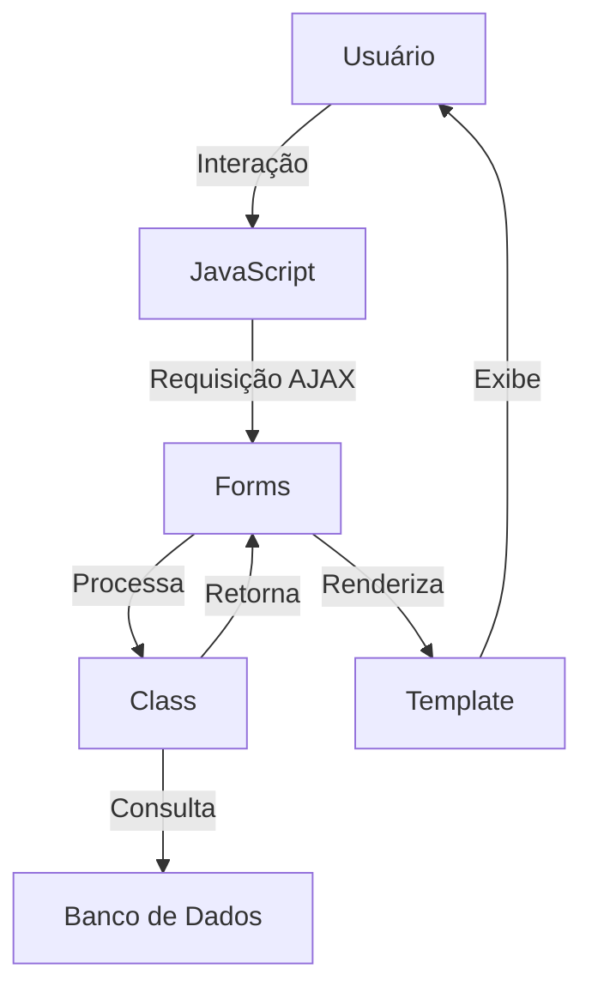
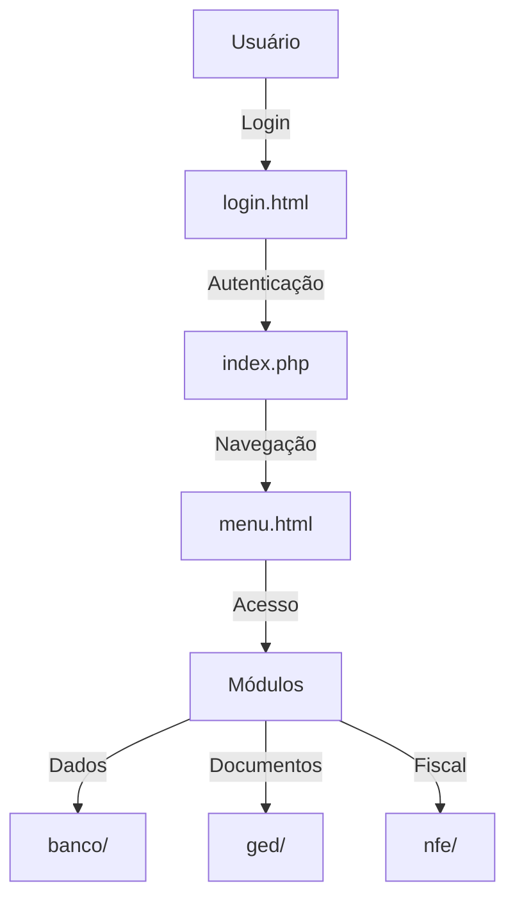

# Documentação Técnica - Sistema ERP
## Versão 4.5

## Índice
1. [Introdução](#1-introdução)
2. [Arquitetura do Sistema](#2-arquitetura-do-sistema)
3. [Módulos do Sistema](#3-módulos-do-sistema)
4. [Fluxos de Processo](#4-fluxos-de-processo)
5. [Requisitos do Sistema](#5-requisitos-do-sistema)
6. [Segurança e Manutenção](#6-segurança-e-manutenção)
7. [Manutenção](#7-manutenção)

## 1. Introdução

### 1.1 Visão Geral
O sistema ERP é uma solução integrada de gestão empresarial que combina funcionalidades de gestão de negócios, CRM, financeiro, estoque e outros módulos essenciais. O sistema foi desenvolvido para atender às necessidades específicas de empresas de médio e grande porte, oferecendo flexibilidade e personalização.

### 1.2 Escopo do Projeto
O sistema abrange os seguintes aspectos principais:
- Gestão de relacionamento com clientes (CRM)
- Gestão financeira
- Controle de estoque
- Gestão de pedidos
- Gestão de documentos fiscais
- Gestão de boletos
- Gestão de catálogo
- PDV (Ponto de Venda)

### 1.1 Versões dos Frameworks e Tecnologias

#### 1.1.1 PHP
- **Versão Atual**: PHP 8.x
- **Requisitos Mínimos**: PHP 7.4+
- **Extensões Necessárias**:
  - PDO
  - MySQLi
  - GD
  - Curl
  - JSON
  - XML
  - Zip
  - BCMath

#### 1.1.2 Smarty Template Engine
- **Versão Atual**: Smarty 4.x
- **Compatibilidade**: PHP 8.x
- **Diretório Base**: `/var/www/html/infoerp/smarty/`
- **Configurações Principais**:
  - Cache habilitado
  - Compilação automática
  - Debugging desabilitado em produção

#### 1.1.3 Bootstrap
- **Versão Atual**: Bootstrap 4.6.x
- **Recursos Utilizados**:
  - Grid System
  - Componentes de UI
  - Utilitários de CSS
  - JavaScript Components

##### Exemplos de Uso do Bootstrap

1. **Grid System**:
```html
<div class="container">
    <div class="row">
        <div class="col-md-6">
            <!-- Conteúdo da coluna esquerda -->
        </div>
        <div class="col-md-6">
            <!-- Conteúdo da coluna direita -->
        </div>
    </div>
</div>
```

2. **Componentes Comuns**:
```html
<!-- Cards -->
<div class="card">
    <div class="card-header">
        <h5 class="card-title">Título do Card</h5>
    </div>
    <div class="card-body">
        Conteúdo do card
    </div>
</div>

<!-- Tabelas -->
<table class="table table-striped table-bordered">
    <thead>
        <tr>
            <th>Coluna 1</th>
            <th>Coluna 2</th>
        </tr>
    </thead>
    <tbody>
        <!-- Dados da tabela -->
    </tbody>
</table>

<!-- Formulários -->
<form class="needs-validation" novalidate>
    <div class="form-group">
        <label for="campo">Label</label>
        <input type="text" class="form-control" id="campo" required>
    </div>
</form>
```

3. **Utilitários**:
```html
<!-- Espaçamento -->
<div class="mt-3 mb-4">
    <!-- Conteúdo com margens -->
</div>

<!-- Flexbox -->
<div class="d-flex justify-content-between">
    <!-- Itens alinhados -->
</div>

<!-- Cores e Backgrounds -->
<div class="bg-primary text-white">
    <!-- Conteúdo com fundo colorido -->
</div>
```

4. **JavaScript Components**:
```html
<!-- Modal -->
<div class="modal fade" id="meuModal">
    <div class="modal-dialog">
        <div class="modal-content">
            <!-- Conteúdo do modal -->
        </div>
    </div>
</div>

<!-- Tooltips -->
<button type="button" class="btn btn-secondary" data-toggle="tooltip" title="Tooltip">
    Botão com tooltip
</button>

<!-- Dropdowns -->
<div class="dropdown">
    <button class="btn btn-secondary dropdown-toggle" type="button" data-toggle="dropdown">
        Dropdown
    </button>
    <div class="dropdown-menu">
        <!-- Itens do dropdown -->
    </div>
</div>
```

##### Integração com Smarty

```smarty
{* Exemplo de template usando Bootstrap *}
<div class="container">
    <div class="row">
        <div class="col-md-6">
            <div class="card">
                <div class="card-header">
                    <h5>{$titulo}</h5>
                </div>
                <div class="card-body">
                    {foreach from=$itens item=item}
                        <div class="alert alert-info">
                            {$item.nome}
                        </div>
                    {/foreach}
                </div>
            </div>
        </div>
    </div>
</div>
```

##### Customizações do Bootstrap

1. **Variáveis SASS**:
```scss
// _variables.scss
$primary: #007bff;
$secondary: #6c757d;
$success: #28a745;
$info: #17a2b8;
$warning: #ffc107;
$danger: #dc3545;
$light: #f8f9fa;
$dark: #343a40;
```

2. **Classes Customizadas**:
```css
/* custom.css */
.btn-custom {
    @extend .btn;
    background-color: #custom-color;
    border-radius: 20px;
}

.card-custom {
    @extend .card;
    box-shadow: 0 2px 4px rgba(0,0,0,0.1);
}
```

## 2. Arquitetura do Sistema

### 2.1 Estrutura de Diretórios
```
/var/www/html/admv4.5/
├── class/                    # Classes PHP
│   ├── crm/                 # Módulo CRM
│   ├── fin/                 # Módulo Financeiro
│   ├── est/                 # Módulo Estoque
│   ├── ped/                 # Módulo Pedidos
│   ├── blt/                 # Módulo Boletos
│   ├── cat/                 # Módulo Catálogo
│   └── util/                # Utilitários
├── forms/                    # Formulários PHP
│   ├── crm/                 # Formulários CRM
│   ├── fin/                 # Formulários Financeiro
│   ├── est/                 # Formulários Estoque
│   └── ...                  # Outros módulos
├── js/                      # Scripts JavaScript
├── css/                     # Estilos CSS
└── template/                # Templates Smarty
```

### 2.2 Tecnologias Utilizadas
- Backend: PHP
- Frontend: HTML, CSS, JavaScript
- Template Engine: Smarty
- Banco de Dados: MySQL/MariaDB
- Servidor Web: Apache/Nginx

### 2.3 Estrutura e Dependências dos Diretórios

#### 2.3.1 Diretório `class/`
- **Propósito**: Contém as classes PHP que implementam a lógica de negócio do sistema
- **Funcionalidades**:
  - Implementação das regras de negócio
  - Manipulação de dados
  - Validações
  - Integrações com banco de dados
- **Dependências**:
  - Requer acesso ao banco de dados
  - Utilizado pelos formulários (`forms/`)
  - Pode ser chamado por scripts JavaScript via AJAX

#### 2.3.2 Diretório `forms/`
- **Propósito**: Contém os controladores PHP que gerenciam as requisições e respostas
- **Funcionalidades**:
  - Recebimento de dados dos formulários
  - Validação de entrada
  - Chamada das classes apropriadas
  - Redirecionamento de páginas
- **Dependências**:
  - Utiliza classes do diretório `class/`
  - Renderiza templates do diretório `template/`
  - Interage com scripts JavaScript do diretório `js/`

#### 2.3.3 Diretório `js/`
- **Propósito**: Contém os scripts JavaScript para interatividade do frontend
- **Funcionalidades**:
  - Validação de formulários no cliente
  - Requisições AJAX
  - Manipulação do DOM
  - Interações do usuário
- **Dependências**:
  - Pode fazer chamadas AJAX para `forms/`
  - Manipula elementos HTML renderizados pelos templates
  - Pode incluir bibliotecas externas

#### 2.3.4 Diretório `template/`
- **Propósito**: Contém os templates Smarty para renderização das páginas
- **Funcionalidades**:
  - Definição da estrutura HTML
  - Inclusão de elementos comuns
  - Formatação de dados
  - Integração com CSS e JavaScript
- **Dependências**:
  - Recebe dados dos controladores em `forms/`
  - Utiliza estilos do diretório `css/`
  - Integra scripts do diretório `js/`

#### 2.3.5 Fluxo de Dados


#### 2.3.6 Exemplo de Fluxo Completo
1. **Requisição de Página**:
   - Usuário acessa uma URL
   - O controlador em `forms/` é acionado
   - O controlador instancia classes necessárias de `class/`
   - Os dados são processados
   - O template apropriado de `template/` é renderizado

2. **Interação com Formulário**:
   - Usuário preenche formulário
   - JavaScript em `js/` valida os dados
   - Dados são enviados via AJAX para `forms/`
   - O controlador processa usando classes de `class/`
   - Resposta é retornada e tratada pelo JavaScript

3. **Atualização de Dados**:
   - JavaScript faz requisição AJAX
   - Controlador em `forms/` recebe a requisição
   - Classes em `class/` processam a atualização
   - Resposta é retornada e a interface é atualizada

### 2.4 Estrutura do Cliente (infoerp)

#### 2.4.1 Visão Geral
O diretório `infoerp` representa a instalação específica do cliente, contendo configurações personalizadas, arquivos de dados e integrações específicas do cliente.

#### 2.4.2 Estrutura de Diretórios
```
/var/www/html/infoerp/
├── banco/                    # Scripts e configurações do banco de dados
├── css/                      # Estilos personalizados do cliente
├── file/                     # Arquivos e documentos do cliente
├── ged/                      # Gestão Eletrônica de Documentos
├── images/                   # Imagens e recursos visuais
├── js/                       # Scripts JavaScript personalizados
├── nfe/                      # Módulo de Nota Fiscal Eletrônica
├── smarty/                   # Templates Smarty personalizados
├── template/                 # Templates HTML personalizados
├── config.php               # Configurações do sistema
├── index.php                # Página principal
├── login.html               # Página de login
├── menu.html                # Menu principal
└── parSistema.php          # Parâmetros do sistema
```

#### 2.4.3 Componentes Principais

##### 2.4.3.1 Configurações do Sistema
- **config.php**: 
  - Configurações de conexão com banco de dados
  - Parâmetros do sistema
  - Configurações de ambiente
  - Chaves de API e integrações

- **parSistema.php**:
  - Parâmetros específicos do cliente
  - Configurações de negócio
  - Preferências do sistema

##### 2.4.3.2 Módulos Específicos
- **ged/**:
  - Gestão Eletrônica de Documentos
  - Armazenamento de documentos
  - Controle de versões
  - Permissões de acesso

- **nfe/**:
  - Emissão de Notas Fiscais
  - Integração com SEFAZ
  - Gestão de documentos fiscais
  - Relatórios fiscais

##### 2.4.3.3 Interface do Usuário
- **login.html**:
  - Página de autenticação
  - Validação de credenciais
  - Recuperação de senha

- **menu.html**:
  - Estrutura de navegação
  - Acesso aos módulos
  - Permissões de usuário

- **index.php**:
  - Dashboard principal
  - Resumo de informações
  - Acesso rápido

##### 2.4.3.3.1 index.php - Controlador Principal
O arquivo `index.php` é o ponto de entrada principal do sistema e possui funções críticas:

1. **Controle de Sessão e Autenticação**:
   - Inicialização da sessão do usuário
   - Validação de credenciais
   - Gerenciamento de estado da sessão
   - Controle de timeout

2. **Gerenciamento de Requisições**:
   - Roteamento de requisições
   - Processamento de parâmetros GET/POST
   - Filtragem de dados contra injeção SQL
   - Controle de acesso aos módulos

3. **Integração com Template Engine**:
   - Inicialização do Smarty
   - Configuração de diretórios de templates
   - Gerenciamento de variáveis de template
   - Renderização de páginas

4. **Tratamento de Exceções**:
   - Manipulação de erros HTTP
   - Logging de exceções
   - Exibição de mensagens de erro
   - Redirecionamento em caso de falha

5. **Fluxo de Navegação**:
   ```mermaid
   graph TD
       A[Requisição] -->|index.php| B{Autenticado?}
       B -->|Não| C[Login]
       B -->|Sim| D{Form?}
       D -->|Sim| E[Processa Form]
       D -->|Não| F[Menu Principal]
       E --> G[Renderiza Template]
       F --> G
   ```

6. **Segurança**:
   - Filtragem de inputs
   - Validação de sessão
   - Controle de acesso
   - Headers de segurança

7. **Importância no Sistema**:
   - Ponto central de controle
   - Gerenciamento de estado
   - Roteamento de requisições
   - Integração de componentes

8. **Exemplo de Fluxo**:
   ```php
   // 1. Inicialização
   require_once("config.php");
   session_start();
   
   // 2. Processamento de Requisição
   $parmPost = filter_input_array(INPUT_POST, FILTER_DEFAULT);
   $parmGet = filter_input_array(INPUT_GET, FILTER_DEFAULT);
   
   // 3. Autenticação
   if ($this->usuario != "") {
       $processo = new c_user();
       $this->userOk = $processo->verificaUsuario();
   }
   
   // 4. Roteamento
   switch ($this->opcao) {
       case 'cadastrar':
           // Processa cadastro
           break;
       case 'pesquisar':
           // Processa pesquisa
           break;
   }
   ```

9. **Dependências**:
   - config.php: Configurações do sistema
   - c_user.php: Gerenciamento de usuários
   - Smarty: Template engine
   - Módulos do sistema

10. **Considerações de Manutenção**:
    - Manter atualizado com as versões do PHP
    - Revisar regularmente as configurações de segurança
    - Documentar alterações no roteamento
    - Monitorar logs de erro

#### 2.4.4 Personalizações
- **css/**: Estilos personalizados para a identidade visual do cliente
- **js/**: Scripts específicos para funcionalidades customizadas
- **template/**: Templates personalizados para as páginas do sistema
- **images/**: Recursos visuais específicos do cliente

#### 2.4.5 Integrações
- **banco/**: Scripts de integração com banco de dados
- **file/**: Armazenamento de arquivos e documentos
- **nfe/**: Integração com sistemas fiscais

#### 2.4.6 Fluxo de Dados do Cliente


#### 2.4.7 Considerações de Segurança
- Autenticação via `login.html`
- Controle de sessão via `logado.php`
- Encerramento de sessão via `desconectar.php`
- Logs de erro em `error_log`

### 2.5 Bibliotecas do Sistema (bib/)

#### 2.5.1 Visão Geral
O diretório `bib/` contém as bibliotecas e classes base do sistema, fornecendo funcionalidades essenciais e reutilizáveis.

#### 2.5.2 Bibliotecas Principais

##### 2.5.2.1 Banco de Dados
- **c_database.php** (11KB)
  - Classe base para operações de banco de dados
  - Gerenciamento de conexões
  - Execução de queries
  - Tratamento de transações

- **c_database_pdo.php** (2.3KB)
  - Implementação PDO para banco de dados
  - Suporte a múltiplos bancos de dados
  - Prepared statements
  - Tratamento de erros

- **c_database_mysql.php** (7.5KB)
  - Implementação específica para MySQL
  - Otimizações para MySQL
  - Funções específicas do MySQL

##### 2.5.2.2 Usuários e Autenticação
- **c_user.php** (20KB)
  - Gerenciamento de usuários
  - Autenticação
  - Permissões
  - Sessões

##### 2.5.2.3 Utilitários
- **c_tools.php** (21KB)
  - Funções utilitárias gerais
  - Manipulação de strings
  - Formatação de dados
  - Validações

- **c_date.php** (6.6KB)
  - Manipulação de datas
  - Formatação
  - Cálculos de datas
  - Fusos horários

##### 2.5.2.4 Comunicação
- **c_mail.php** (18KB)
  - Envio de emails
  - Templates de email
  - Anexos
  - Configurações SMTP

- **class.phpmailer.php** (97KB)
  - Biblioteca PHPMailer
  - Suporte a HTML
  - Múltiplos destinatários
  - Anexos

##### 2.5.2.5 Documentos e Relatórios
- **dompdf/** (Diretório)
  - Geração de PDFs
  - Conversão HTML para PDF
  - Templates de documentos
  - Estilização

- **SimpleXLSX.php** (27KB)
  - Manipulação de arquivos Excel
  - Leitura de planilhas
  - Exportação de dados
  - Formatação

##### 2.5.2.6 Tratamento de Erros
- **httpException.php** (360B)
  - Tratamento de exceções HTTP
  - Códigos de erro
  - Mensagens personalizadas
  - Logging

#### 2.5.3 Dependências e Integrações

##### 2.5.3.1 Bibliotecas Externas
- **PHPMailer/**
  - Envio de emails
  - Suporte a SMTP
  - Templates HTML
  - Anexos

- **calendar/**
  - Componentes de calendário
  - Agendamentos
  - Eventos
  - Interface gráfica

##### 2.5.3.2 Recursos
- **imagens/**
  - Ícones do sistema
  - Imagens padrão
  - Recursos visuais
  - Templates de imagem

#### 2.5.4 Uso das Bibliotecas

##### 2.5.4.1 Exemplo de Conexão com Banco
```php
require_once(ADMbib."/c_database.php");
$db = new c_database();
$db->connect();
$result = $db->query("SELECT * FROM usuarios");
```

##### 2.5.4.2 Exemplo de Envio de Email
```php
require_once(ADMbib."/c_mail.php");
$mail = new c_mail();
$mail->setTo("destinatario@email.com");
$mail->setSubject("Assunto");
$mail->setBody("Corpo do email");
$mail->send();
```

##### 2.5.4.3 Exemplo de Geração de PDF
```php
require_once(ADMbib."/dompdf/dompdf.php");
$dompdf = new DOMPDF();
$dompdf->load_html($html);
$dompdf->render();
$pdf = $dompdf->output();
```

#### 2.5.5 Considerações de Manutenção
- Manter bibliotecas atualizadas
- Documentar alterações
- Testar compatibilidade
- Seguir padrões de código

### 2.6 Template Engine (Smarty)

#### 2.6.1 Visão Geral
O sistema utiliza o Smarty como template engine para separar a lógica de negócio da apresentação. A versão atual é compatível com PHP 8.x.

#### 2.6.2 Estrutura de Diretórios
```
/var/www/html/infoerp/smarty/
├── templates_c/        # Templates compilados
├── cache/             # Cache de templates
└── configs/           # Configurações do Smarty
```

#### 2.6.3 Configuração do Smarty
```php
// Configuração em index.php
$this->smarty = new Smarty;

// Diretórios
$this->smarty->setTemplateDir(ADMraizCliente."/template/".$this->modulo);
$this->smarty->setCompileDir(ADMraizCliente."/smarty/templates_c/");
$this->smarty->setConfigDir(ADMraizCliente."/smarty/configs/");
$this->smarty->setCacheDir(ADMraizCliente."/smarty/cache/");

// Configurações de Cache
$this->smarty->caching = Smarty::CACHING_LIFETIME_CURRENT;
$this->smarty->cache_lifetime = 120;
```

#### 2.6.4 Exemplos de Uso

1. **Template Básico**:
```smarty
{* template.tpl *}
<!DOCTYPE html>
<html>
<head>
    <title>{$titulo}</title>
</head>
<body>
    <h1>{$titulo}</h1>
    {if $usuario}
        <p>Bem-vindo, {$usuario->nome}!</p>
    {/if}
    
    {foreach from=$itens item=item}
        <div class="item">
            <h2>{$item.titulo}</h2>
            <p>{$item.descricao}</p>
        </div>
    {/foreach}
</body>
</html>
```

2. **Renderização no PHP**:
```php
// Atribuir variáveis
$this->smarty->assign('titulo', 'Dashboard');
$this->smarty->assign('usuario', $usuario);
$this->smarty->assign('itens', $itens);

// Renderizar template
$this->smarty->display('template.tpl');
```

3. **Modificadores**:
```smarty
{* Modificadores de string *}
{$texto|upper}
{$texto|lower}
{$texto|capitalize}
{$texto|truncate:30:"..."}

{* Modificadores de data *}
{$data|date_format:"%d/%m/%Y"}
{$data|date_format:"%H:%M:%S"}

{* Modificadores de número *}
{$valor|number_format:2:",":"."}
{$valor|string_format:"%.2f"}
```

4. **Funções**:
```smarty
{* Funções de inclusão *}
{include file="header.tpl"}
{include file="menu.tpl" usuario=$usuario}

{* Funções de ciclo *}
{cycle values="odd,even"}
{cycle name="row" values="1,2,3,4,5"}

{* Funções de debug *}
{debug}
```

5. **Condicionais**:
```smarty
{if $condicao}
    Conteúdo se verdadeiro
{elseif $outra_condicao}
    Conteúdo alternativo
{else}
    Conteúdo padrão
{/if}

{* Operadores de comparação *}
{if $valor == 10}
{if $valor != 10}
{if $valor > 10}
{if $valor >= 10}
{if $valor < 10}
{if $valor <= 10}
```

#### 2.6.5 Boas Práticas

1. **Organização de Templates**:
```smarty
{* Estrutura recomendada *}
{include file="header.tpl"}
{include file="menu.tpl"}

{block name="conteudo"}
    {* Conteúdo específico da página *}
{/block}

{include file="footer.tpl"}
```

2. **Cache e Performance**:
```php
// Habilitar cache
$this->smarty->caching = Smarty::CACHING_LIFETIME_CURRENT;
$this->smarty->cache_lifetime = 3600; // 1 hora

// Limpar cache
$this->smarty->clearCache('template.tpl');
$this->smarty->clearAllCache();
```

3. **Segurança**:
```smarty
{* Escapar HTML *}
{$texto|escape:'html'}

{* Escapar JavaScript *}
{$texto|escape:'javascript'}

{* Escapar URLs *}
{$url|escape:'url'}
```

#### 2.6.6 Troubleshooting

1. **Problemas de Cache**:
```bash
# Limpar cache manualmente
rm -rf /var/www/html/infoerp/smarty/templates_c/*
rm -rf /var/www/html/infoerp/smarty/cache/*
```

2. **Problemas de Permissão**:
```bash
# Ajustar permissões
chmod -R 755 /var/www/html/infoerp/smarty/templates_c
chmod -R 755 /var/www/html/infoerp/smarty/cache
```

3. **Debug**:
```php
// Habilitar debug
$this->smarty->debugging = true;
$this->smarty->debug_tpl = 'file:debug.tpl';
```

#### 2.6.7 Atualização para PHP 8

1. **Compatibilidade**:
```php
// Verificar versão do Smarty
if (Smarty::SMARTY_VERSION < '4.0.0') {
    // Atualizar para versão compatível com PHP 8
}
```

2. **Novas Funcionalidades**:
```smarty
{* Null coalescing operator *}
{$valor ?? 'padrão'}

{* Arrow functions *}
{function name="processa" params=$x}
    {$x * 2}
{/function}
```

3. **Depreciações**:
```smarty
{* Antes *}
{$var|default:"valor"}

{* Depois *}
{$var ?? "valor"}
```

## 3. Módulos do Sistema

### 3.1 Módulo CRM
- Gestão de clientes (PF/PJ)
- Acompanhamento de contas
- Gestão de oportunidades
- Dashboard de vendas
- Agenda e calendário
- Relatórios gerenciais

### 3.2 Módulo Financeiro
- Contas a pagar
- Contas a receber
- Fluxo de caixa
- Relatórios financeiros
- Integração com boletos

### 3.3 Módulo Estoque
- Controle de inventário
- Movimentações
- Produtos e serviços
- Relatórios de estoque
- Nota fiscal

### 3.4 Módulo Pedidos
- Gestão de pedidos
- Propostas comerciais
- Acompanhamento de vendas
- Integração com estoque

### 3.5 Módulo Boletos
- Geração de boletos
- Gestão de cobranças
- Integração bancária
- Relatórios de cobrança

## 4. Fluxos de Processo

### 4.1 Fluxo de Vendas
1. Cadastro de Cliente
2. Criação de Pedido
3. Aprovação
4. Separação de Estoque
5. Nota fiscal
6. Faturamento
7. Geração de Boleto
8. Acompanhamento

### 4.2 Fluxo Financeiro
1. Recebimento de Pedido
2. Geração de Contas
3. Aprovação
4. Pagamento
5. Conciliação
6. Relatórios

## 5. Requisitos do Sistema

### 5.1 Requisitos de Hardware
- Servidor:
  - CPU: 4 cores ou superior
  - RAM: 8GB mínimo
  - HD: 100GB mínimo
  - Rede: 1Gbps

- Estação de Trabalho:
  - CPU: 2 cores ou superior
  - RAM: 4GB mínimo
  - HD: 50GB mínimo
  - Monitor: 1366x768 mínimo

### 5.2 Requisitos de Software
- Sistema Operacional:
  - Servidor: Linux (Ubuntu/Debian)
  - Cliente: Windows 10/11, Linux

- Servidor Web:
  - Apache 2.4+ ou Nginx 1.18+
  - PHP 7.4+
  - MySQL 5.7+ ou MariaDB 10.3+

- Navegadores Suportados:
  - Chrome 80+
  - Firefox 75+
  - Edge 80+

### 5.3 Requisitos de Rede
- Largura de Banda: 10Mbps mínimo
- Latência: < 100ms
- Firewall: Portas 80/443 abertas
- VPN: Recomendado para acesso remoto

## 6. Segurança e Manutenção

### 6.1 Segurança
- Autenticação em dois fatores
- Criptografia de dados sensíveis
- Backup diário automático
- Logs de auditoria
- Políticas de acesso baseadas em perfil

### 6.2 Manutenção
- Backup:
  - Diário: Incremental
  - Semanal: Completo
  - Mensal: Completo + Logs

- Atualizações:
  - Correções: Imediatas
  - Melhorias: Mensais
  - Versões: Trimestrais

### 6.3 Suporte
- Horário: 8h às 18h (Seg-Sex)
- Canais:
  - Email: suporte@admsistema.com.br
  - Sistema de Tickets

## 7. Manutenção

### 7.1 Logs

#### 7.1.1 Estrutura de Logs
```
/var/www/html/infoerp/
├── error_log           # Log principal de erros
└── logs/              # Diretório de logs específicos
    ├── access.log     # Log de acessos
    ├── error.log      # Log de erros
    ├── nfe.log        # Log de operações NFe
    └── ged.log        # Log de operações GED
```

#### 7.1.2 Tipos de Logs
1. **Logs de Erro**:
   - Erros de PHP
   - Exceções não tratadas
   - Falhas de conexão
   - Erros de banco de dados

2. **Logs de Acesso**:
   - Login de usuários
   - Acessos a módulos
   - Operações críticas
   - Tentativas de acesso não autorizado

3. **Logs de Negócio**:
   - Operações NFe
   - Movimentações financeiras
   - Alterações em cadastros
   - Processos automatizados

#### 7.1.3 Configuração de Logs
```php
// Configuração em config.php
define('ADMlog', true);  // Ativa logs
define('ADMlogPath', ADMraizCliente.'/logs/');  // Diretório de logs

// Exemplo de logging
function logError($message, $type = 'ERROR') {
    $logFile = ADMlogPath . date('Y-m-d') . '.log';
    $logMessage = date('Y-m-d H:i:s') . " [$type] $message\n";
    file_put_contents($logFile, $logMessage, FILE_APPEND);
}
```

#### 7.1.4 Rotação de Logs
- Logs diários
- Retenção por 30 dias
- Compressão após 7 dias
- Limpeza automática

### 7.2 Backup

#### 7.2.1 Tipos de Backup
1. **Backup Completo**:
   - Banco de dados
   - Arquivos do sistema
   - Configurações
   - Logs

2. **Backup Incremental**:
   - Alterações diárias
   - Novos arquivos
   - Modificações em documentos

3. **Backup de Banco**:
   - Dump completo
   - Transações
   - Estrutura
   - Dados

#### 7.2.2 Estrutura de Backup
```
/backup/
├── daily/              # Backups diários
│   └── YYYY-MM-DD/
├── weekly/             # Backups semanais
│   └── YYYY-WW/
└── monthly/            # Backups mensais
    └── YYYY-MM/
```

#### 7.2.3 Scripts de Backup
```bash
#!/bin/bash
# backup.sh

# Backup do banco
mysqldump -u $DB_USER -p$DB_PASSWORD $DB_NAME > backup/daily/$(date +%Y-%m-%d)/db.sql

# Backup de arquivos
rsync -av /var/www/html/infoerp/ backup/daily/$(date +%Y-%m-%d)/files/

# Compressão
tar -czf backup/daily/$(date +%Y-%m-%d).tar.gz backup/daily/$(date +%Y-%m-%d)/
```

#### 7.2.4 Política de Retenção
- Diários: 7 dias
- Semanais: 4 semanas
- Mensais: 12 meses
- Anuais: 5 anos

### 7.3 Troubleshooting

#### 7.3.1 Problemas Comuns

1. **Erros de Conexão**:
   ```php
   // Verificar conexão
   try {
       $db = new PDO("mysql:host=".HOSTNAME, DB_USER, DB_PASSWORD);
   } catch (PDOException $e) {
       logError("Erro de conexão: " . $e->getMessage());
   }
   ```

2. **Problemas de Sessão**:
   ```php
   // Verificar sessão
   if (!isset($_SESSION['user_array'])) {
       header('Location: login.html');
       exit;
   }
   ```

3. **Erros de Permissão**:
   ```php
   // Verificar permissões
   if (!file_exists(ADMdoc)) {
       mkdir(ADMdoc, 0755, true);
   }
   ```

#### 7.3.2 Procedimentos de Diagnóstico

1. **Verificação de Sistema**:
   ```bash
   # Verificar espaço em disco
   df -h
   
   # Verificar logs
   tail -f /var/www/html/infoerp/error_log
   
   # Verificar permissões
   ls -la /var/www/html/infoerp/
   ```

2. **Testes de Conexão**:
   ```php
   // Testar conexão com banco
   $db = new c_database();
   $result = $db->query("SELECT 1");
   
   // Testar conexão com serviços
   $nfe = new c_nfe();
   $status = $nfe->verificaStatus();
   ```

3. **Monitoramento de Recursos**:
   ```bash
   # CPU e Memória
   top
   
   # Processos PHP
   ps aux | grep php
   
   # Conexões MySQL
   mysqladmin processlist
   ```

#### 7.3.3 Procedimentos de Recuperação

1. **Recuperação de Banco**:
   ```bash
   # Restaurar backup
   mysql -u $DB_USER -p$DB_PASSWORD $DB_NAME < backup.sql
   ```

2. **Recuperação de Arquivos**:
   ```bash
   # Restaurar arquivos
   tar -xzf backup.tar.gz -C /var/www/html/infoerp/
   ```

3. **Limpeza de Cache**:
   ```bash
   # Limpar cache Smarty
   rm -rf /var/www/html/infoerp/smarty/templates_c/*
   
   # Limpar cache PHP
   rm -rf /tmp/php_*
   ```

#### 7.3.4 Contato de Suporte

⚠️ **Notas Importantes**:
1. Manter backups regulares
2. Documentar alterações
3. Seguir padrões de código
4. Testar em homologação

Última atualização: 12/06/2024

Esta documentação é parte do sistema ERP e deve ser mantida atualizada com as mudanças do sistema. 