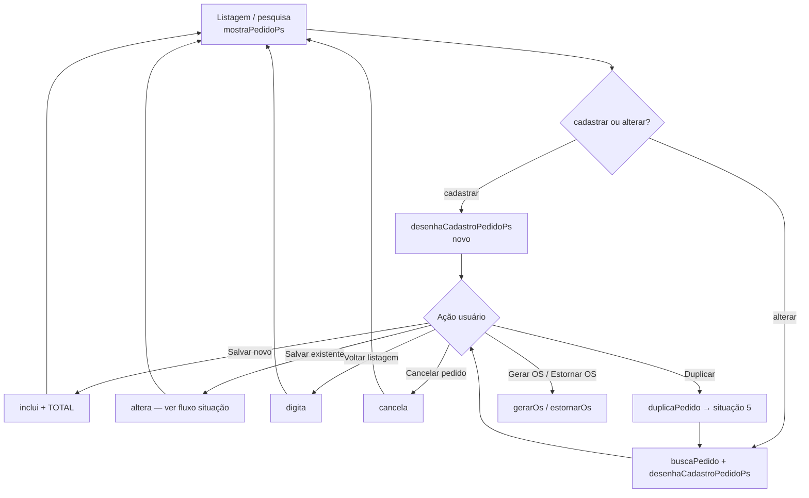
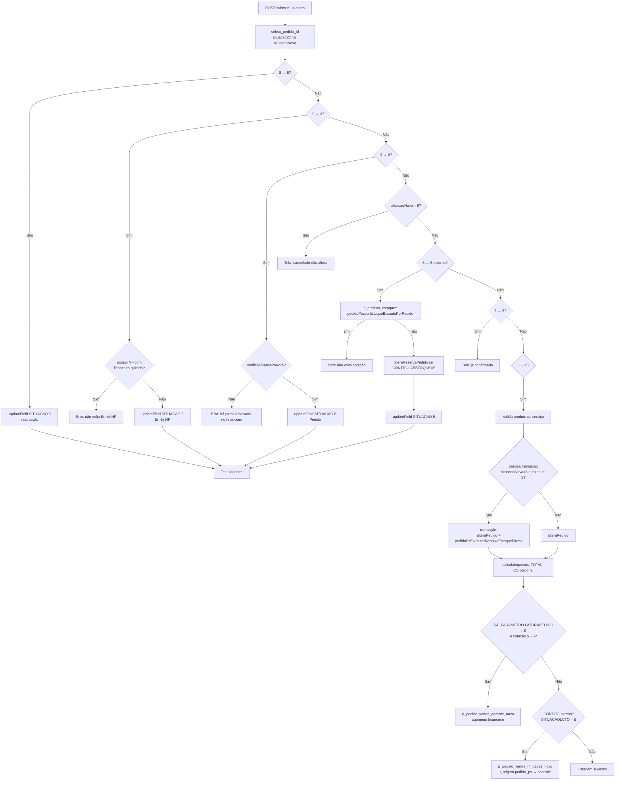

# Fluxo do Pedido PS (Peças / Serviços)

Documentação do fluxo **Pedido de Vendas PS**, com foco em **arquivos**, **funções** e **controle de situação** (`SITUACAO` na tabela `FAT_PEDIDO`).

---

## Visão geral


| Camada                          | Arquivo principal                            | Papel                                                             |
| ------------------------------- | -------------------------------------------- | ----------------------------------------------------------------- |
| Apresentação / roteamento       | `forms/ped/p_pedido_ps.php`                  | Classe `p_pedido_ps` — método `controle()` despacha por `submenu` |
| Domínio / persistência          | `class/ped/c_pedido_ps.php`                  | Classe `c_pedido_ps` — CRUD pedido, itens, serviços, consultas    |
| Front (browser)                 | `js/ped/s_pedido_ps.js`                      | Define `submenu` no POST e validações antes do submit             |
| Template                        | `template/ped/pedido_ps_cadastro.tpl`        | Tela de cadastro / listagem                                       |
| NF / Financeiro (integração)    | `forms/ped/p_pedido_venda_nf_pecas_novo.php` | Após salvar com condição “extrato”, ou fluxo de NF/financeiro     |
| Baixa de estoque pós-financeiro | `class/ped/c_pedido_venda_nf.php`            | `pedidoPsPosFinanceiroBaixaEstoque()`                             |
| Utilitários desconto            | `class/ped/c_pedido_ps_tools.php`            | Ex.: `recalcularDescontoPecas()`                                  |


A classe de formulário **herda** a de negócio: `p_pedido_ps extends c_pedido_ps`.

---

## Situação do pedido (`FAT_PEDIDO.SITUACAO`)

O **status** do pedido é o campo `**SITUACAO`** (numérico no uso atual). Neste módulo, os **rótulos exibidos** (combo da situação na listagem / cadastro e descrição na pesquisa por letra) vêm **somente** da tabela `**AMB_DDM`**:

- Filtro: `ALIAS = 'FAT_MENU'` e `CAMPO = 'SITUACAOPEDIDO'`.
- Campos usados no PHP: `TIPO` (código da situação, casado com `FAT_PEDIDO.SITUACAO`) e `PADRAO` (texto exibido).

Exemplo no formulário (`desenhaCadastroPedidoPs` / combo situação):

`SELECT TIPO AS ID, PADRAO AS DESCRICAO FROM AMB_DDM WHERE ALIAS='FAT_MENU' AND CAMPO='SITUACAOPEDIDO'`

A consulta `select_pedido_letra` em `c_pedido_ps` também faz join com esse mesmo domínio (`SITUACAODESC`). **Não** use `CAT_SITUACAO` como referência para textos desta tela.

**Valores usados explicitamente no código do Pedido PS** (os nomes amigáveis vêm do cadastro em `**AMB_DDM`** no seu ambiente):


| Valor  | Uso no código                                                                                                                                                                        |
| ------ | ------------------------------------------------------------------------------------------------------------------------------------------------------------------------------------ |
| **5**  | Cotação — pedido novo, duplicado, carrinho, reativação a partir de cancelado                                                                                                         |
| **6**  | Pedido confirmado — gravação com reserva de estoque (se filial controla)                                                                                                             |
| **3**  | Emitir NF — transição manual permitida a partir de baixado (9)                                                                                                                       |
| **8**  | Cancelado                                                                                                                                                                            |
| **9**  | Baixado / pago (ex.: extrato cadastrado com sucesso; comentários no código como “PAGO”). Voltar para **3** fica bloqueado se `pedidoPossuiNotaComFinanceiroBaixado()` for verdadeiro |
| **12** | Situação usada como filtro padrão na listagem (junto com 5) quando o usuário não seleciona situações |
| **13** | **Encomenda** — aguardando entrada de estoque (`ENCOMENDA=S` e itens indisponíveis na confirmação 5→6); financeiro pode abrir na confirmação |


Outros fluxos do sistema (pedido farma, importação, etc.) podem usar outros códigos; este documento cobre o **Pedido PS** em `p_pedido_ps.php` / `c_pedido_ps.php` e o encadeamento em `p_pedido_venda_nf_pecas_novo.php`.

---

## Roteamento: `p_pedido_ps::controle()`

O método `**controle()`** em `forms/ped/p_pedido_ps.php` faz `switch ($this->m_submenu)` e aciona telas ou operações. Principais casos:


| `submenu`                       | Direito (`PedVendas`) | Ação resumida                                                                                                                                                                                                                                                                    |
| ------------------------------- | --------------------- | -------------------------------------------------------------------------------------------------------------------------------------------------------------------------------------------------------------------------------------------------------------------------------- |
| `cadastrar`                     | I                     | `desenhaCadastroPedidoPs()` — novo pedido                                                                                                                                                                                                                                        |
| `alterar`                       | A                     | `buscaPedido()` + tela; bloqueia se não achar pedido                                                                                                                                                                                                                             |
| `inclui`                        | A                     | Novo pedido: `incluiPedido()`, atualiza `TOTAL`                                                                                                                                                                                                                                  |
| `altera`                        | A                     | Salvar alterações + regras de situação e estoque (ver fluxograma)                                                                                                                                                                                                                |
| `digita`                        | C                     | Volta para listagem `mostraPedidoPs()`                                                                                                                                                                                                                                           |
| `cancela`                       | E                     | Cancelamento (`SITUACAO = 8`) se `verificaFinanceiroNota()` permitir. **Regra atual**: antes de marcar como cancelado o PHP executa `pedidoPsExecutarReservaEstoqueFarma()` em transação (zera a reserva e refaz reserva de itens `UNIFRACIONADA='N'`, e valida disponibilidade) |
| `recalcularDesconto`            | I                     | `c_pedido_ps_tools::recalcularDescontoPecas()`                                                                                                                                                                                                                                   |
| `gerarOs` / `estornarOs`        | E                     | Atualiza vínculo OS / limpa dados OS                                                                                                                                                                                                                                             |
| `duplicaPedido`                 | E                     | `duplicaPedido()`, itens e serviços; novo registro em cotação (5)                                                                                                                                                                                                                |
| `atualizarInfo`                 | A                     | Recalcula impostos na tela                                                                                                                                                                                                                                                       |
| `prosseguirComDesconto`         | —                     | AJAX: retorna `SITUACAO` atual                                                                                                                                                                                                                                                   |
| `cadastrarCarrinho`             | I                     | Pedido a partir de JSON (e-commerce); situação inicial **5**                                                                                                                                                                                                                     |
| `cadastrarCarrinhoPedidoExiste` | I                     | Atualiza pedido existente do carrinho                                                                                                                                                                                                                                            |
| `vendaPerdida`                  | —                     | Marca itens perdidos / total                                                                                                                                                                                                                                                     |
| `ajax_obra`, `ajax_enderecos`   | —                     | Respostas JSON                                                                                                                                                                                                                                                                   |
| `simulaImpostos`                | —                     | Relatório de impostos                                                                                                                                                                                                                                                            |
| `abrirDashboardCrm`             | A                     | Abre última cotação (5) do cliente ou novo cadastro                                                                                                                                                                                                                              |


Valores de `**submenu`** são definidos no JavaScript (`js/ped/s_pedido_ps.js`), por exemplo: `submitDigitacao()` → `digita`, `submitGerarOs()` → `gerarOs`, confirmação de salvar → `altera`.

---

## Funções principais em `c_pedido_ps`


| Função                                            | Função na prática                                                                                                                                                                                              |
| ------------------------------------------------- | -------------------------------------------------------------------------------------------------------------------------------------------------------------------------------------------------------------- |
| `buscaPedido()`                                   | Carrega cabeçalho do pedido (`select_pedido_id`) nos setters do objeto                                                                                                                                         |
| `incluiPedido($conn)`                             | `INSERT` em `FAT_PEDIDO` (inclui `SITUACAO` atual do objeto)                                                                                                                                                   |
| `alteraPedido($conn)`                             | `UPDATE FAT_PEDIDO` (cabecalho, inclusive `SITUACAO`)                                                                                                                                                          |
| `select_pedido_id()`                              | SELECT por `ID`                                                                                                                                                                                                |
| `updateField($field, $valor, $tabela, $conn)`     | UPDATE genérico por `id` do pedido                                                                                                                                                                             |
| `pedidoPsExecutarReservaEstoqueFarma($conn)`      | **Reserva/validação de estoque** na transação: chama `liberaReservaPedido()` e em seguida reserva itens com `UNIFRACIONADA='N'`; depois valida quantidade disponível via `verify_itemns_order_product()`       |
| `verificaFinanceiroNota($idPedido)`               | Retorna **true** quando **não há bloqueio** (sem NF ligada ao pedido e sem financeiro baixado ligado ao pedido/NF). Usado para permitir **cancelar** e também para permitir mudanças de fase **9→3** e **3→6** |
| `pedidoPossuiNotaComFinanceiroBaixado($idPedido)` | Retorna **true** quando existe NF do pedido com financeiro baixado (`SITPGTO='B'`). Usado para bloquear **9→3**                                                                                                |
| `prosseguirComDesconto()`                         | Consulta `SITUACAO` para decisão no front                                                                                                                                                                      |
| `duplicaPedido()`                                 | Novo registro com `SITUACAO = 5`                                                                                                                                                                               |
| Itens / serviços                                  | `incluiProduto`, `alteraProduto`, `excluiPedidoItemProduto`, `incluiServicos`, `alteraServicos`, `excluiServicosItemAtendimento`, etc.                                                                         |
| OS                                                | `atualizaOsPedido()`, `estornaDadosOsPedido()`                                                                                                                                                                 |
| Totais / impostos                                 | `calculaImpostos()`, agregações de itens e serviços                                                                                                                                                            |


**Estoque (classe `c_produto_estoque`)** — pontos citados no fluxo PS:

- `liberaReservaPedido` — usado no estorno 6→5 e dentro de `pedidoPsExecutarReservaEstoqueFarma`
- `pedidoPossuiEstoqueBaixadoPorPedido` — bloqueia estorno para cotação se já houve baixa
- `produtoReserva` / validações — dentro de `pedidoPsExecutarReservaEstoqueFarma`

---

## Fluxograma — ciclo de vida da tela e submenu




---

## Fluxograma — `altera` (situação e estoque)

Trecho principal em `forms/ped/p_pedido_ps.php` (`case 'altera'`).




---

## Integração financeira / NF (`p_pedido_venda_nf_pecas_novo`)

Se `FAT_PARAMETRO.FATURAPEDIDO = 'S'` na filial e a transição foi **cotação → pedido (5→6)**, abre o financeiro via **Gerência Pedido Novo** (`p_pedido_venda_conferecia_novo`, `submenu = financeiro`), sem depender da condição de pagamento.

Quando `FATURAPEDIDO = 'N'` (padrão) e o pedido é salvo com **condição de pagamento de extrato** (`FAT_COND_PGTO.SITUACAOLCTO = 'E'`), o formulário instancia `p_pedido_venda_nf_pecas_novo` com origem `pedido_ps` e chama `controle()`.

Pontos que **alteram `FAT_PEDIDO.SITUACAO`** nesse arquivo:

- `**cadastraFinanceiro**` com extrato (`SITUACAOLCTO == 'E'`): após sucesso em `addParcelaExtratoOrigemPS`, atualiza situação para **9** via `c_pedidoVenda::atualizarField('SITUACAO','9')`, depois `pedidoPsPosFinanceiroBaixaEstoque()`.
- Cadastro de parcelas com integração financeira (`INTEGRAFIN == 'S'`): após `addParcelas` e baixa de estoque, atualiza `SITUACAO` para `**pos_financeiro_ps`** (POST), restrito a **3** ou **9** (default **3**).

`pedidoPsPosFinanceiroBaixaEstoque` (em `c_pedido_venda_nf`): se a filial controla estoque, executa `produtoBaixaReservaFinanceiro` por item — **transição da reserva após o financeiro**.

---

## Referência rápida de arquivos

```
forms/ped/p_pedido_ps.php          → controle(), telas, regras altera/cancela
class/ped/c_pedido_ps.php         → dados FAT_PEDIDO / itens / serviços / reserva
js/ped/s_pedido_ps.js             → submenu e validações
forms/ped/p_pedido_venda_nf_pecas_novo.php → NF, financeiro, situação 9 / 3
class/ped/c_pedido_venda_nf.php   → pedidoPsPosFinanceiroBaixaEstoque
class/ped/c_pedido_ps_tools.php   → recálculo de desconto; resolver encomenda na confirmação
class/ped/c_pedido_venda_tools.php → validaPedido, alteraDadosPedido, alteraPedidoEncomenda
class/est/c_produto.php           → select_produto_encomenda, select_lancamento
class/est/c_produto_estoque.php   → reserva, liberação, baixa, verificações
forms/est/p_movimentacao_estoque_cc.php → entrada CC libera encomenda 13→6
forms/ped/p_rel_compra_encomenda.php    → relatório compra/encomenda (hub: pedido_relatorios)
```

---

## Fluxo de encomenda (situação 13)

Quando `FAT_PARAMETRO.ENCOMENDA = 'S'` na filial e `EST_PARAMETRO.CONTROLAESTOQUE = 'S'`:

1. Na confirmação **cotação → pedido (5→6)**, `c_pedido_ps_tools::pedidoPsResolverConfirmacaoEstoque()` chama `c_pedido_venda_tools::validaPedido()` no centro de custo de entrega.
2. Se houver itens com **quantidade em falta** → `SITUACAO = 13` (**encomenda**).
3. **Encomenda NÃO reserva estoque** (nem peça nem fracionado). Apenas a **falta** (`max(0, solicitado − disponível)`) entra na demanda de encomenda; o saldo livre segue disponível para venda imediata.
4. Se `FATURAPEDIDO = 'S'` ou condição de pagamento extrato (`SITUACAOLCTO = 'E'`), abre financeiro/NF **mesmo em encomenda**.
5. `pedidoPsPosFinanceiroBaixaEstoque()` **não executa** enquanto `SITUACAO = 13`.
6. **Operação no dia a dia** (sem tela extra de alocação):
   - **Relatório Compra por Encomenda** (`Estoque → Relatórios`) — produtos com **COMPRA > 0** (o que falta comprar/receber).
   - **Gerência de Pedidos** — filtrar situação **13** para ver pedidos/clientes em encomenda.
   - No **cadastro do pedido PS** (sit 13): **Validar Estoque** → se todos OK, **Pedido** → sit **6** (reserva só na confirmação).
7. Opcional após entrada de NF: modal na **movimentação CC** lista pedidos com falta do produto entrado (atalho para liberar).

Parâmetros relacionados: `ENCOMENDA`, `FATURAPEDIDO`, `FLUXOPEDIDO` (conferência/romaneio na Gerência — ver `docs/fluxo_gerencia_pedidos.md`).

---

## Observação para manutenção

Os **números de situação** são constantes implícitas no PHP; os **nomes amigáveis** na tela Pedido PS dependem exclusivamente do cadastro em `**AMB_DDM`** (`FAT_MENU` / `SITUACAOPEDIDO`). Ao incluir uma nova fase, cadastrar o domínio ali e revisar `altera` / template (`pedido_ps_cadastro.tpl`) onde há `if $situacao == …`.

---

## Bloqueios de edição no cadastro (front)

No cadastro (`pedido_ps_cadastro.tpl` + `js/ped/s_pedido_ps.js`), ao carregar a página o JS executa `aplicarBloqueioPedidoPsCadastro()` e **bloqueia edição** quando `situacao` é **6**, **8**, **3**, **9** ou **13** (ex.: desabilita cliente, data, botões de itens/serviços e alguns botões de pesquisa).

Exceção importante: ao executar ações de **mudança de situação via botões** (ex.: **Reativar Cotação**, **Voltar p/ Emitir NF**, **Voltar p/ Pedido**, **Estorno**, **Pedido**) o JS **reabilita** alguns `select`s/inputs antes do submit e envia `submenu=altera` com a `situacao` alvo.

---

## Gerência de Pedidos (após confirmar como Pedido)

Conferência, financeiro e emissão fiscal ocorrem na tela **Gerência de Pedidos** (`pedido_venda_gerente_novo`), não no cadastro PS.

Documentação dedicada:

- Técnica: `docs/fluxo_gerencia_pedidos.md`
- Roteiro manual: `docs/roteiros_manual/roteiro_gerencia_pedidos.md`
- PDF: `manual/ped/gerenciapedido.pdf`