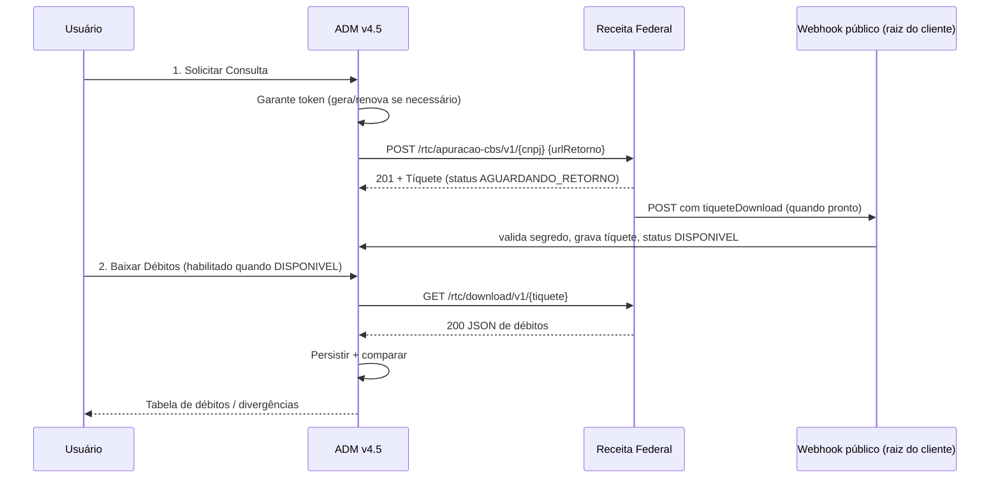

# Documentação Técnica — Apuração Assistida IBS/CBS

## Sistema ADM v4.5 — Módulo EST

## Índice

1. [Visão geral](#1-visão-geral)
2. [Arquitetura e arquivos](#2-arquitetura-e-arquivos)
3. [Fluxo da API (3 passos)](#3-fluxo-da-api-3-passos)
4. [Limites de requisição](#4-limites-de-requisição)
5. [Estrutura das tabelas](#5-estrutura-das-tabelas)
6. [Acesso e permissões](#6-acesso-e-permissões)
7. [Endpoints AJAX](#7-endpoints-ajax)
8. [Evento de aceite](#8-evento-de-aceite)
9. [Homologação (ambiente Beta)](#9-homologação-ambiente-beta)
10. [Pontos de atenção](#10-pontos-de-atenção)

---

## 1. Visão geral


### 1.1 Propósito

O módulo **Apuração Assistida IBS/CBS** integra o ADM v4.5 à API da Receita Federal para:

1. Autenticar via OAuth 2.0 (`client_credentials`)
2. Solicitar consulta de apuração (recebe **tíquete**)
3. Baixar o JSON de débitos
4. Persistir e **comparar** com apurações anteriores
5. Registrar **evento de aceite**


### 1.2 URL de acesso

```
index.php?mod=est&form=apuracao_cbs
```


### 1.3 Direito de programa

`EstApuracaoCbs`

---


## 2. Arquitetura e arquivos

```
/var/www/html/admv4.5/
├── class/est/
│   ├── c_apuracao_cbs.php              # Sets/gets + regras + integração HTTP
│   ├── c_apuracao_cbs_repository.php   # PDO (padrão c_api_inter_repository)
│   └── doc_apuracao_cbs.md
├── forms/est/
│   └── p_apuracao_cbs.php              # controle() via submenu + submit (padrão p_cclasstrib)
├── js/est/
│   └── s_apuracao_cbs.js               # submitXxx() simples (padrão s_manifesto_fiscal)
├── template/est/
│   ├── apuracao_cbs_mostra.tpl
│   └── apuracao_cbs_detalhe.tpl
└── bib/clientes_migracao_4_5/
    └── est_apuracao_cbs.sql
```

**Herança:** `p_apuracao_cbs` → `c_apuracao_cbs` → `c_user`  
**Persistência:** `c_apuracao_cbs_repository` (PDO)

---


## 3. Fluxo da API (assíncrono com webhook)

O token é obtido, persistido e renovado **automaticamente** pelo back-end (reutilizado enquanto válido, ~1h). O fluxo é **assíncrono**: ao solicitar a consulta, a Receita responde **201** e entrega o **tíquete de download** mais tarde, via **webhook** (`urlRetorno`). Só depois de recebido o retorno o download é liberado.

Para o usuário: **Solicitar Consulta** → aguardar retorno automático (status `AGUARDANDO_RETORNO` → `DISPONIVEL`) → **Baixar Débitos**. O botão **Atualizar** recarrega o histórico; **Testar credenciais** (configuração) apenas valida a geração do token, sendo opcional.




### URLs


| Ambiente          | Token                                                  | API base                                         | Prefixo de path |
| ----------------- | ------------------------------------------------------ | ------------------------------------------------ | --------------- |
| Homologação       | `https://h-gateway.receitaintegra.serpro.gov.br/token` | `https://h-gateway.receitaintegra.serpro.gov.br` | `/rtc`          |
| Produção Restrita | `https://api.receitafederal.gov.br/token`              | `https://api.receitafederal.gov.br`              | `/prr-rtc`      |
| Produção          | `https://api.receitafederal.gov.br/token`              | `https://api.receitafederal.gov.br`              | `/rtc`          |


- **Solicitar:** `POST {base}{prefixo}/apuracao-cbs/v1/{cnpj}` com body `{ "urlRetorno": "<webhook>" }` → sucesso **201**.
- **Download:** `GET {base}{prefixo}/download/v1/{tiqueteDownload}` → **200** (sucesso), **403** (CNPJ divergente), **404** (tíquete inválido/expirado/já baixado). 1 acesso por tíquete.

Credenciais (`client_id` / `client_secret`) são geradas no Portal Nacional da Tributação sobre o Consumo → serviço **Gerar Credencial para API**.

---


## 4. Limites de requisição


| Operação           | Limite                   | Controle                                                       |
| ------------------ | ------------------------ | -------------------------------------------------------------- |
| Solicitar consulta | **2 / CNPJ / dia**       | Banco (`EST_APURACAO_CBS_HISTORICO.DT_SOLICITACAO`) + HTTP 429 |
| Download           | **8 / CNPJ / dia**       | Banco (`DT_DOWNLOAD`) + HTTP 429                               |
| Token              | Validade ~**60 minutos** | Reutilizado se ainda válido                                    |
| Arquivo JSON       | Validade **24 horas**    | `DT_EXPIRA_ARQUIVO`                                            |


O controle de limite é feito **no backend** (não apenas no front), para garantir integridade em múltiplas sessões.

---


## 5. Estrutura das tabelas

Script: `bib/clientes_migracao_4_5/est_apuracao_cbs.sql`


| Tabela                               | Função                                                                                                   |
| ------------------------------------ | -------------------------------------------------------------------------------------------------------- |
| `EST_APURACAO_CBS_CREDENCIAL`        | client_id, secret (AES-256-CBC), token, ambiente, `WEBHOOK_URL`, `WEBHOOK_SECRET`                        |
| `EST_APURACAO_CBS_HISTORICO`         | Cada solicitação (tíquete, status, datas)                                                                |
| `EST_APURACAO_CBS_DEBITO`            | Débitos por DF-e (chave, NIs, saldos CBS, papel, autorização, prescrição) + flag de divergência          |
| `EST_APURACAO_CBS_PGTO`              | Formas de extinção: pagamentos de CBS / split (`pagamentosCBS`)                                          |
| `EST_APURACAO_CBS_CREDITO_UTILIZADO` | Formas de extinção: créditos utilizados (`creditosCBS` / `creditosPISCOFINS`) com `ORIGEM`/modelo/número |
| `EST_APURACAO_CBS_EVENTO`            | Eventos por `CHAVE_DFE`; `ORIGEM` = `LOCAL` (emitido por nós) ou `RF` (retornado na apuração)            |
| `EST_APURACAO_CBS_WEBHOOK_LOG`       | Auditoria dos POSTs recebidos no webhook (IP, headers, payload, tíquete, processado)                     |


### Modelagem por DF-e (nível 3 do JSON)

Cada registro de `EST_APURACAO_CBS_DEBITO` representa **uma nota** (`CHAVE_DFE`), não um total por competência.
A tela de pendências usa `VALOR_CBS_NAO_EXTINTO > 0` para identificar dívida em aberto.
O campo `PAPEL_EMPRESA` (`EMITENTE` | `DESTINATARIO` | `OUTRO`) é calculado comparando o `CNPJ_BASE` (8 chars) com os 8 primeiros do `NI_EMITENTE`/`NI_ADQUIRENTE`.

> **CNPJ alfanumérico (NT 2026.004):** `CNPJ_BASE`, `NI_EMITENTE` e `NI_ADQUIRENTE` aceitam letras. A sanitização em `setCnpjBase()` mantém `[A-Z0-9]`.


### Catálogo de eventos por papel

Definido em `c_apuracao_cbs::catalogoEventos()`.


| Papel                     | Aba                | Eventos                                                      |
| ------------------------- | ------------------ | ------------------------------------------------------------ |
| DESTINATARIO (adquirente) | Pendências Crédito | 211110, 211128, 211130, 211140, 211150, 211124 (série 2xxxx) |
| EMITENTE (fornecedor)     | Pendências Débito  | 112110, 112130, 112140, 112150 (série 1xxxx)                 |


### Layout oficial do JSON (`formasExtincao`)

Cada débito (nível 3, dentro da subchave `debitos` de cada grupo) traz `formasExtincao` como **objeto** com:

- `creditosCBS[]` → crédito `TIPO_TRIBUTO=CBS` (`cClassCred`, `chaveDfe`, `dataCreditoUtilizado`, `valorCreditoUtilizadoPrincipal/Multa/Juros`)
- `creditosPISCOFINS[]` → crédito `TIPO_TRIBUTO=PISCOFINS` (`origem`, `dataCreditoUtilizado`, `valorCreditoUtilizado`, multa, juros)
- `pagamentosCBS[]` → pagamento (`numeroDarf`, `tipoPagamento`, `dataDarfArrecadado`, `dataDarfUtilizado`, `valorDarfUtilizadoPrincipal/Multa/Juros`)
- `prescricao` → grava `VALOR_PRESCRITO` / `DATA_PRESCRITO` no próprio débito
- `eventos[]` (nível 4) → gravados em `EST_APURACAO_CBS_EVENTO` com `ORIGEM='RF'`

Parsing em `normalizarItensDebito()` + `extrairFormasExtincao()` + `extrairEventosRf()`.

### Status do histórico

`SOLICITADO` → `AGUARDANDO_RETORNO` → `DISPONIVEL` → `BAIXADO` | `ERRO` | `EXPIRADO`

- `AGUARDANDO_RETORNO`: consulta aceita (201); aguardando o tíquete pelo webhook.
- `DISPONIVEL`: webhook recebido; download liberado.


### Status do evento no débito

`PENDENTE` → `REGISTRADO` | `ERRO`

### Comparação entre downloads

A comparação é feita por `CHAVE_DFE` (não mais por competência+tipo): marca `DIVERGENTE = 'S'` quando o saldo `VALOR_CBS_NAO_EXTINTO` ou a `SITUACAO_DEBITO` mudam em relação ao download anterior da mesma chave.

---


## 6. Acesso e permissões


| Ação      | Letra | Uso                                       |
| --------- | ----- | ----------------------------------------- |
| Consultar | C     | Tela, listagens, token, download, limites |
| Incluir   | I     | Salvar credencial, solicitar consulta     |
| Alterar   | A     | Atualizar credencial                      |
| Emitir    | E     | Emitir aceite                             |


Menu (cliente): item **Apuração Assistida IBS/CBS** em Estoque → `?mod=est&form=apuracao_cbs`

Em cada cliente, incluir a linha no `template/menuopen.tpl` e executar o SQL de `AMB_FORM` / `AMB_USUARIO_AUTORIZA`.

---


## 7. Ações (submenu via POST)

O front usa `f.submenu.value = '...'` + `f.submit()` (sem AJAX na regra principal).


| submenu              | Direito | Descrição                                                 |
| -------------------- | ------- | --------------------------------------------------------- |
| `salvar_credencial`  | I       | Salva/atualiza client_id/secret                           |
| `gerar_token`        | C       | OAuth token                                               |
| `solicitar_consulta` | I       | Solicita tíquete                                          |
| `download_debitos`   | C       | Baixa JSON e persiste                                     |
| `ver_debitos`        | C       | Lista débitos do histórico na tela / atualiza o histórico |
| `emitir_evento`      | E       | Registra evento fiscal por chave                          |


Feedback via SweetAlert2 ecoado pelo form (`msgSwal`), no padrão `p_cclasstrib` / `p_manifesto_fiscal`.

JS: `submitSalvarCredencial()`, `submitGerarToken()`, `submitSolicitarConsulta()`, `submitDownloadDebitos()`, `submitVerDebitos()`, `submitAtualizarHistorico()`, `submitEmitirEvento()`, `apuracaoConfirmarEvento()`, `apuracaoBaixarXml()`, `apuracaoSetAba()`.

### Receptor de webhook (entrega assíncrona do tíquete)

- **Handler:** `class/est/c_apuracao_cbs_webhook.php` (`c_apuracao_cbs_webhook::processar()`), sem dependência de sessão.
  1. Registra o POST bruto em `EST_APURACAO_CBS_WEBHOOK_LOG`.
  2. Extrai `cnpj` e `tiqueteDownload`, valida o `WEBHOOK_SECRET` da credencial (via `hash_equals`).
  3. Correlaciona à solicitação `AGUARDANDO_RETORNO` do CNPJ e grava o tíquete → status `DISPONIVEL`.
  4. Se o payload já trouxer o JSON de débitos (`apuracaoCorrente`/`apuracaoAjuste`/`debitosExtemporaneos`), persiste direto (`persistirDebitos`) e marca `BAIXADO`.
- **Endpoint público (por cliente):** modelo em `bib/clientes_migracao_4_5/webhook_apuracao_cbs.php`. Deve ser copiado para a **raiz do cliente** (mesma pasta do `config.php`); inclui o bootstrap do cliente + o handler. A `urlRetorno` cadastrada nas credenciais deve apontar para esse arquivo (HTTPS público). O segredo pode vir no header `X-Webhook-Secret` ou em `?secret=`.


### Organização da tela (abas)

1. **Pendências Crédito** (papel DESTINATARIO): eventos 2xxxx por linha.
2. **Pendências Débito** (papel EMITENTE): eventos 1xxxx por linha.
3. **Histórico de Eventos**: registros de `EST_APURACAO_CBS_EVENTO`.
4. **Consulta RF / Credenciais**: credenciais, fluxo assíncrono (Solicitar → aguardar webhook → Baixar) e histórico de tíquetes com status.

A aba ativa é preservada no reload via campo hidden `aba`.

---


## 8. Eventos fiscais

Os eventos são emitidos **por chave de acesso** (`CHAVE_DFE`) e separados pelo papel da empresa na nota (Emitente x Destinatário).

Comportamento atual (registro local):

1. `emitirEvento()` valida a chave (44 dígitos), o tipo de evento no catálogo e a coerência com o papel do débito.
2. Grava em `EST_APURACAO_CBS_EVENTO` com status `REGISTRADO`.
3. Atualiza `EST_APURACAO_CBS_DEBITO.STATUS_EVENTO` para `REGISTRADO` (quando há débito vinculado).

> **Envio à RF:** ainda **não** há chamada HTTP para emissão. Os endpoints oficiais dos eventos (séries 1xxxx e 2xxxx) serão adicionados quando publicados no Swagger. Como o vínculo é por `CHAVE_DFE`, o histórico de eventos sobrevive a re-downloads (que apagam e regravam os débitos).

> **Eventos retornados pela RF:** os eventos presentes no JSON da apuração (nível 4) são gravados automaticamente com `ORIGEM='RF'` (payload bruto em `JSON_RETORNO`), separados dos eventos `ORIGEM='LOCAL'` emitidos pela tela.

---


## 9. Homologação (ambiente Beta)

1. Acessar o Portal do Piloto RTC/CBS e gerar `client_id` / `client_secret`
2. No ADM, ambiente = **Homologação**
3. Informar CNPJ base (8 dígitos) da empresa do piloto, a **Webhook URL** pública e (opcional) o **Segredo do Webhook**
4. Copiar `bib/clientes_migracao_4_5/webhook_apuracao_cbs.php` para a raiz do cliente e apontar a `urlRetorno` para ele
5. Salvar credenciais → Solicitar Consulta → aguardar retorno (status `DISPONIVEL`) → Baixar Débitos
6. Validar comparação e emissão de aceite local


### Aplicar DDL

```bash
mysql -u USUARIO -p NOME_BANCO < bib/clientes_migracao_4_5/est_apuracao_cbs.sql
```

---


## 10. Pontos de atenção

- `client_secret` é armazenado com **AES-256-CBC** (chave derivada de `DB_NAME` + `HOSTNAME`)
- A **Webhook URL** (`urlRetorno`) é **pré-requisito** para solicitar consulta e precisa ser pública/HTTPS (acessível pela RF)
- O parse do JSON percorre os grupos por tipo de apuração (`apuracaoCorrente`, `apuracaoAjuste`, `debitosExtemporaneos` → subchave `debitos`) e as `formasExtincao` (`creditosCBS`, `creditosPISCOFINS`, `pagamentosCBS`, `prescricao`); a normalização fica em `normalizarItensDebito()` + `extrairFormasExtincao()`
- No download, **403** = CNPJ divergente do tíquete; **404** = tíquete inválido/expirado/já baixado; HTTP 202/204 = arquivo ainda em processamento
- O botão **Baixar XML** é um hook (`apuracaoBaixarXml()`); a integração com o serviço de consulta por chave (`NfeDistribuicaoDFe`) é uma evolução futura
- Demais clientes devem receber o item de menu em seus respectivos `menuopen.tpl`

